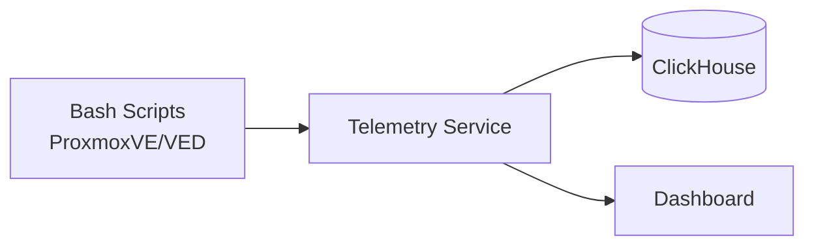

# services

Backend services for [ProxmoxVE](https://github.com/community-scripts/ProxmoxVE) and
[ProxmoxVED](https://github.com/community-scripts/ProxmoxVED), in one Go module:

| Service | Path | What it does |
| --- | --- | --- |
| **Telemetry** | `cmd/telemetry` | Collects anonymous install telemetry from the bash scripts and serves the public dashboard |
| **Discord bot** | `cmd/discord` | Turns a Discord support thread into a GitHub issue on a moderator's command |

Each builds its own binary and its own image; they share nothing but the module.

```bash
go build ./cmd/telemetry
go build ./cmd/discord
go test ./...
```

---

## Telemetry — overview

This service acts as a telemetry ingestion layer between the bash installation scripts and a ClickHouse backend. When users run scripts from the ProxmoxVE/ProxmoxVED repositories, optional anonymous usage data is sent here for aggregation and analysis.

**What gets collected:**

- Script name and installation status (success/failed)
- Container/VM type and resource allocation (CPU, RAM, disk)
- OS type and version
- Proxmox VE version
- Anonymous session ID (randomly generated UUID)

**What is NOT collected:**

- IP addresses (not logged, not stored)
- Hostnames or domain names
- User credentials or personal information
- Hardware identifiers (MAC addresses, serial numbers)
- Network configuration or internal IPs
- Any data that could identify a person or system

**What this enables:**

- Understanding which scripts are most popular
- Identifying scripts with high failure rates
- Tracking resource allocation trends
- Improving script quality based on real-world data

## Features

- **Telemetry Ingestion** - Receives and validates telemetry data from bash scripts
- **ClickHouse Storage** - Stores and aggregates records in ClickHouse
- **Rate Limiting** - Configurable per-IP rate limiting to prevent abuse
- **Caching** - In-memory or Redis-backed caching support
- **Email Alerts** - SMTP-based alerts when failure rates exceed thresholds
- **Dashboard** - Built-in HTML dashboard for telemetry visualization

## Architecture



## Dashboard

The built-in dashboard is publicly available at `https://telemetry.community-scripts.org/` and is served from `/` (with `/dashboard` kept as a compatibility alias). It provides real-time analytics:

- **Installation Statistics** - Total installs, success/failure rates
- **Top Applications** - Most installed scripts with counts
- **Failure Analysis** - Scripts with highest failure rates (min. 10 installs)
- **Resource Trends** - CPU, RAM, disk allocation over time
- **OS Distribution** - Popular operating systems
- **Proxmox Versions** - PVE version distribution

**Dashboard Features:**

- Automatic cache warmup (every 4 minutes)
- Configurable time range (7, 30, 90, 365 days)
- Shows actual total count vs. analyzed sample size
- Loading indicator during data fetch

## Project Structure

```
cmd/telemetry/
  service.go        # HTTP handlers, rate limiting
  clickhouse.go     # Storage and aggregation queries
  cache.go          # In-memory and Redis caching
  alerts.go         # SMTP alert system
  dashboard.go      # Shared dashboard data types
  public/           # Dashboard templates and assets (go:embed)
cmd/discord/
  main.go           # Session, command registration, interaction handling
  thread.go         # Thread reader and issue renderer
  store.go          # PocketBase client
  github.go         # GitHub App auth and issue creation
Dockerfile          # Telemetry image
Dockerfile.discord  # Discord bot image
entrypoint.sh       # Telemetry container entrypoint
go.mod              # Go module definition
```

`public/` and `testdata/` live beside the telemetry sources rather than at the
repository root because `//go:embed` cannot reach into a parent directory.

## Related Projects

- [ProxmoxVE](https://github.com/community-scripts/ProxmoxVE) - Proxmox VE Helper Scripts
- [ProxmoxVED](https://github.com/community-scripts/ProxmoxVED) - Proxmox VE Helper Scripts (Dev)

## API Endpoints

| Endpoint          | Method | Description                              |
| ----------------- | ------ | ---------------------------------------- |
| `/`               | GET    | HTML dashboard UI                        |
| `/dashboard`      | GET    | Compatibility alias for the dashboard UI |
| `/telemetry`      | POST   | Receive telemetry data from scripts      |
| `/healthz`        | GET    | Health check endpoint                    |
| `/api/dashboard`  | GET    | Dashboard data as JSON                   |
| `/api/records`    | GET    | Paginated installation log data          |
| `/api/scripts`    | GET    | Script analysis data                     |
| `/api/exit-codes` | GET    | Exit-code reference data                 |
| `/metrics`        | GET    | Prometheus-style metrics output          |

Operational endpoints also exist for alerts and cleanup workflows, including `/api/alerts`, `/api/cleanup/status`, and `POST /api/cleanup/run`.

## Privacy & Compliance

This service is designed with privacy in mind and is **GDPR/DSGVO compliant**:

- ✅ **No personal data** - Only anonymous technical metrics are collected
- ✅ **No IP logging** - Request logging is disabled by default, IPs are never stored
- ✅ **Transparent** - All collected fields are documented and the code is open source
- ✅ **No tracking** - Session IDs are randomly generated and cannot be linked to users
- ✅ **No third parties** - Data is only stored in our self-hosted PocketBase instance

For full details, see:

- **[Privacy & Telemetry Documentation](docs/PRIVACY.md)** — What we collect, how, and why
- **[Records of Processing Activities (ROPA)](docs/ROPA.md)** — GDPR Art. 30
- **[Technical & Organizational Measures (TOMS)](docs/TOMS.md)** — GDPR Art. 32

---

## Discord bot

Turns a Discord support thread into a GitHub issue when a moderator asks for it. The
thread is copied across verbatim — authors, timestamps, message order — so nothing is
summarised away or has to be retyped.

Right-click any message in a thread or forum post → **Apps → Create GitHub Issue**. The
reply is ephemeral; the issue link is posted once into the thread.

### Behaviour

- **Moderator only.** The command is hidden from members without *Manage Messages*, but
  that is cosmetic — the binding check runs server-side against
  `discord_config.allowed_role_ids`.
- **One issue per thread**, enforced by a unique index on `discord_issues.thread_id`. A
  second run returns the existing link.
- **Images are linked, not rehosted.** Discord attachment URLs are signed and expire
  after roughly 24 hours, so every attachment also carries a permanent link to its
  message, and the issue header links the thread.
- **Long threads are truncated** below GitHub's 65536-character body limit, with a
  pointer back to Discord.

### Setup

1. *Discord application* — enable the **Message Content** intent, invite with the `bot`
   and `applications.commands` scopes, grant **Read Message History** and **Send
   Messages** in the support channels. The context-menu command registers itself per
   guild at startup, so it appears immediately.
2. *GitHub App* — **Issues: Read and write** on the target repository; note app id,
   installation id and private key.
3. *PocketBase* — import `cmd/discord/pocketbase-schema.json` under *Settings → Import
   collections*, then add one `discord_config` record:

   | Field | Type | Example |
   | --- | --- | --- |
   | `guild_id` | text | `000000000000000001` |
   | `allowed_role_ids` | json | `["000000000000000002"]` |
   | `target_repo` | text | `community-scripts/ProxmoxVE` |
   | `default_labels` | json | `["bug"]` |
   | `enabled` | bool | `true` |

   Snowflakes are `text` on purpose — they are 64-bit and JavaScript clients would
   silently mangle them past 2^53 as numbers.

### Environment

`DISCORD_TOKEN`, `GITHUB_APP_ID`, `GITHUB_APP_INSTALLATION_ID`,
`GITHUB_APP_PRIVATE_KEY` (PEM or base64, in any mangling an env field inflicts),
`POCKETBASE_URL`, `POCKETBASE_ADMIN_EMAIL`, `POCKETBASE_ADMIN_PASSWORD`, optional
`MAX_THREAD_MESSAGES` (default 500).

Optional `POCKETBASE_AUTH_COLLECTION` authenticates against a normal auth
collection instead of the superuser, so the bot can run with an account that only
reaches its own two collections. Set it to the collection name and put that
account's identity and password in `POCKETBASE_ADMIN_EMAIL` /
`POCKETBASE_ADMIN_PASSWORD`. The collections then need API rules: `discord_config`
list and view, `discord_issues` list, view and create.

## License

MIT License - see [LICENSE](LICENSE) file.
